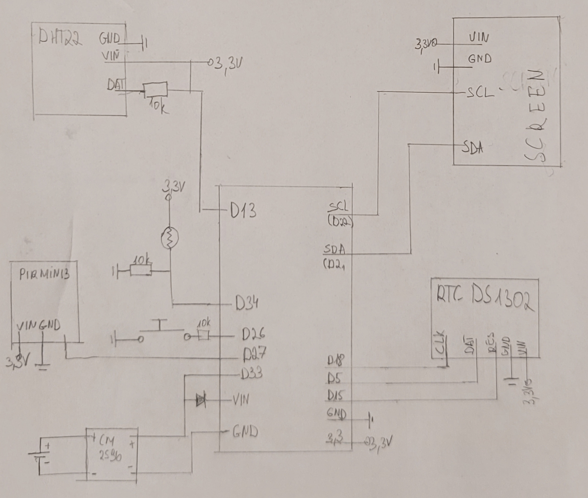

## Szükséges ezsközök
 - ESP32 dev board
 - DHT22
 - kijelző (ssd1306 oled)
 - PIR MINI3
 - RTC DS1302
 - LM 2596
 - 9V elem
 - nyomógomb
 - micro usb kábel
 - 9v elem csatlakozó
 - 3*10kohm ellenállás
 - vezetékek
 - breadboard

## Kapcsolási rajz



## Szükséges software
    - anaconda python
    - putty
    - vscode + python pluginok
    - micropython firmware
    - esptool (python modul)
    - ampy (python modul)


## Felhasznált tutorialok
    - https://lastminuteengineers.b-cdn.net/wp-content/uploads/iot/ESP32-Pinout.png
    - https://micropython.org/download/esp32/
    - https://conda.io/projects/conda/en/latest/user-guide/tasks/manage-environments.html
    - https://learn.adafruit.com/micropython-hardware-digital-i-slash-o/digital-inputs
    - https://randomnerdtutorials.com/  esp32-esp8266-dht11-dht22-micropython-temperature-humidity-sensor/
    - https://randomnerdtutorials.com/esp32-esp8266-analog-readings-micropython/
    - https://github.com/omarbenhamid/micropython-ds1302-rtc
    - https://docs.micropython.org/en/latest/esp32/quickref.html
    - https://pythonforundergradengineers.com/how-to-install-micropython-on-an-esp32.html
    - https://techtotinker.com/2020/11/017-esp32-micropython-dht-values-auto-updates-using-ajax/
    - https://randomnerdtutorials.com/micropython-oled-display-esp32-esp8266/
    - https://www.youtube.com/watch?v=5vnW4U5Vj0k

## Szükséges parancsok
### Flashelés

Egyszer szükséges hogy a firmware felkerüljön az eszközre.

Firmware: https://micropython.org/download/esp32/

Törölni kell először az elöző flasht az eszközről:
```
esptool.py --chip esp32 --port /dev/ttyUSB0 erase_flash
```
firmware t6elepítése:
```
esptool --chip esp32 --port COMx --baud 460800 write_flash -z 0x1000
```
### Fileok másolása windowson

```
ampy --port COMX put FILENAME
```

## Használat
A következő fileok szükségesek az eszközön:

    - smart_home.py
    - smart_home_site.py
    - ds1302.py
    - ssd1306.py

Bootolás után a következő parancsokat kell kiadni. Amennyiben a main.py is felkerül az automatikusan végrehajtja ezt, de manuálisan egyszerűbb a fejlesztés mintha automatikusan indulna.

```
from smart_home import SmartHome
sh = SmartHome()
sh.start()
```
